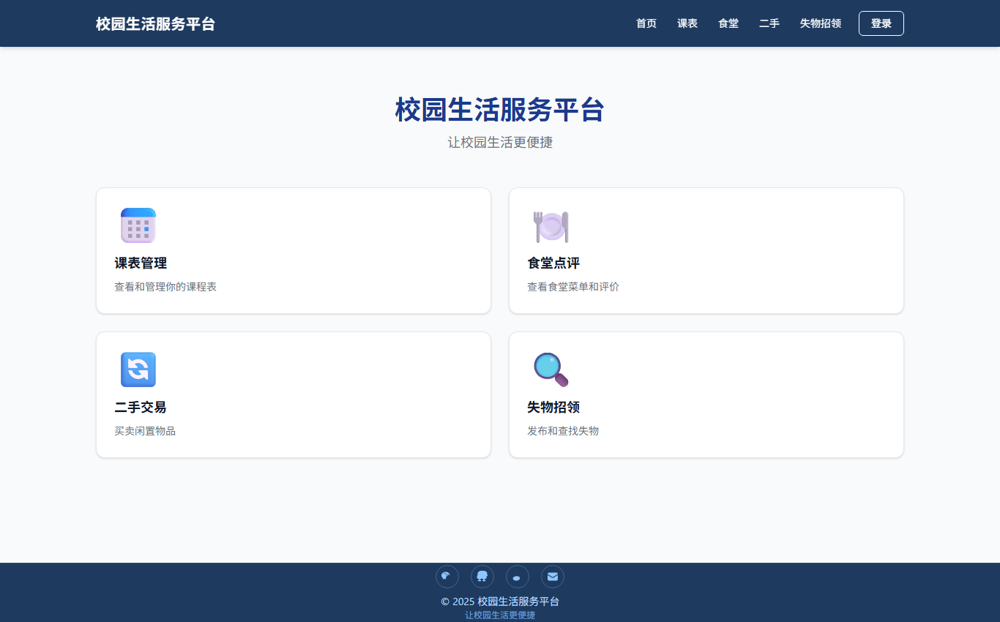
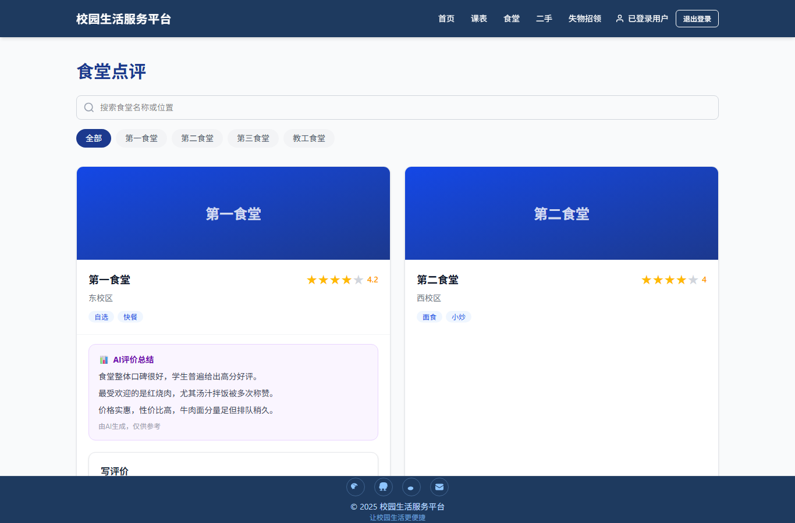
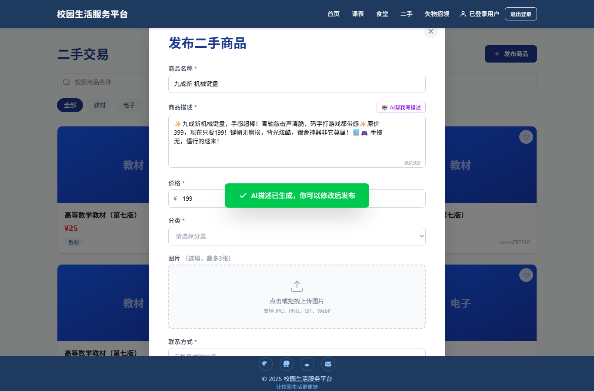
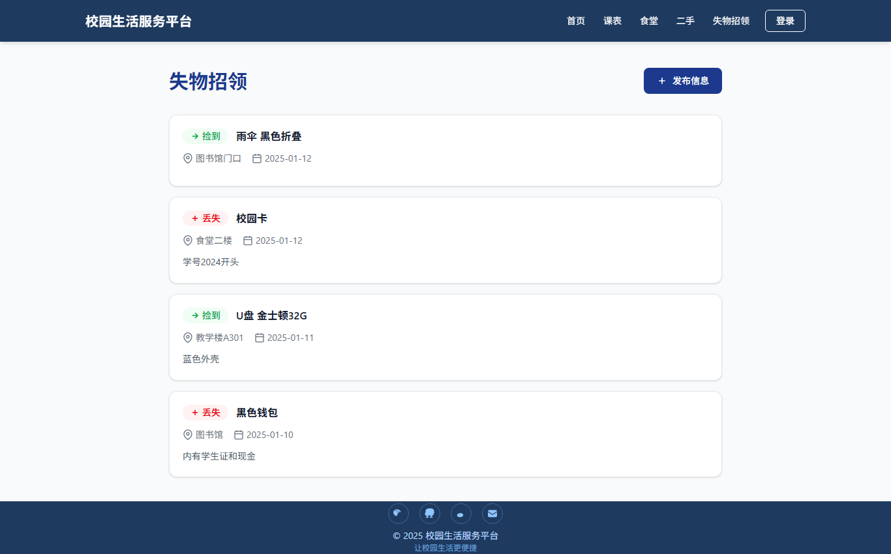
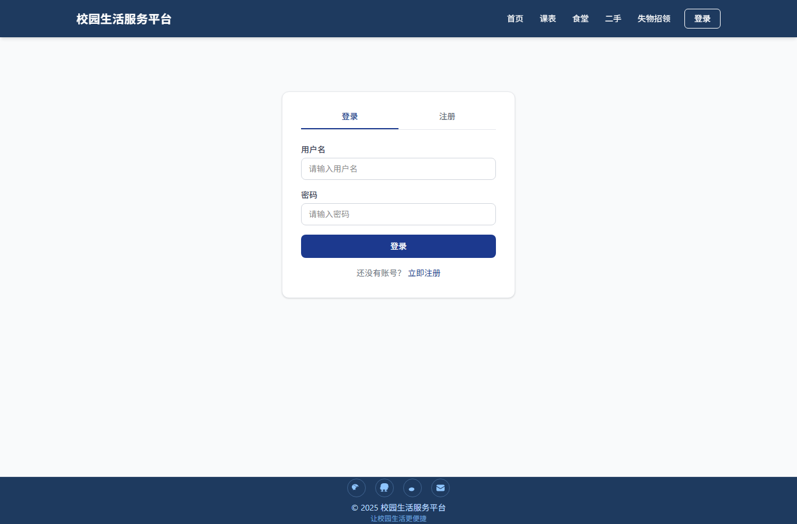
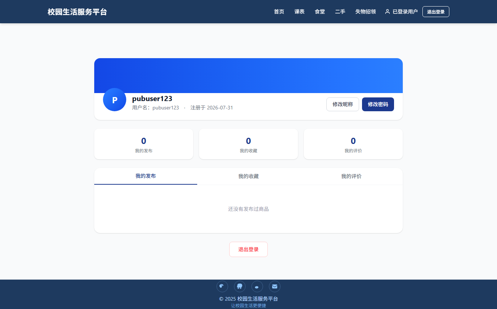

# 🏫 校园生活服务平台 (Campus Life Platform)

一个面向高校师生的综合校园生活服务平台，集成**课程表管理、食堂点评（含 AI 总结）、二手交易（含 AI 描述生成）、失物招领、个人中心**等核心功能。前端使用 React + Vite + Tailwind CSS，后端使用 Node.js + Express + SQLite（sql.js），支持 JWT 用户认证与 DeepSeek AI 能力。

## 🔗 仓库地址

**GitHub**：https://github.com/MOMOmmm510/campus-life-platform

## 📸 功能截图

### 首页
提供校园生活核心功能入口，覆盖课表、食堂、二手交易、失物招领四大模块导航。



### 食堂点评 + AI 总结
浏览食堂列表并查看评分与标签，点击「AI总结」由 DeepSeek 自动分析全部评价，提炼食堂口碑亮点。



### 二手交易 + AI 描述
发布闲置商品时填写名称与价格，点击「🤖 AI帮我写描述」即可由 AI 自动生成生动文案，省时省力。



### 失物招领
发布丢失 / 捡到信息，按类型和关键词筛选，快速匹配失主与拾主。



### 登录 / 注册
基于 JWT 的用户认证体系，支持注册、登录、退出。



### 个人中心
集中查看我的发布、收藏、评价数据看板，支持修改昵称与密码。



## ✨ 功能列表

| 模块 | 功能 |
|------|------|
| 🗓️ 课程表 | 生物技术专业课程表，周视图/列表视图切换 |
| 🍽️ 食堂点评 | 食堂列表、搜索筛选、星级评分、发表评价、**AI 自动总结食堂口碑** |
| 🔄 二手交易 | 发布闲置商品、分类筛选、收藏商品、**AI 生成商品描述**、标记已售出 |
| 🔍 失物招领 | 发布丢失/捡到信息、按类型/关键词筛选、联系方式展示 |
| 👤 用户系统 | 注册、登录（JWT）、个人信息查看与修改（昵称/密码） |
| 💡 AI 能力 | 食堂评价智能总结、商品描述智能生成（DeepSeek） |
| 📊 个人中心 | 我的发布/收藏/评价数据看板、账户设置、退出登录 |

## 🛠️ 技术栈

### 前端
- **React 19** + **TypeScript**
- **Vite 8**（构建工具）
- **Tailwind CSS 4**（样式）
- **React Router 7**（路由）

### 后端
- **Node.js** + **Express 5**
- **sql.js**（SQLite WASM，免安装数据库）
- **jsonwebtoken**（JWT 认证）
- **bcryptjs**（密码加密）
- **DeepSeek API**（AI 能力）

## 🌍 部署链接

| 环境 | 地址 |
|------|------|
| 🌐 前端（Vercel） | https://frontend-momo-ddc1.vercel.app |
| ⚙️ 后端 API（Railway） | https://campus-api-production-d64c.up.railway.app |
| 📋 后端 API 示例 | `GET /api/canteens` → 返回食堂 JSON 数据 |

> 后端 API 基址通过环境变量 `VITE_API_BASE` 注入前端，前端所有请求走 `/api/*` 路径。

## 📁 项目结构

```
campus/
├── frontend/               # 前端应用（React + Vite）
│   ├── src/
│   │   ├── pages/          # 页面组件（首页/课表/食堂/二手/失物/登录/个人中心）
│   │   ├── components/     # 通用组件（导航栏/表单/星级评分等）
│   │   ├── config/         # API 配置
│   │   └── data/           # 本地 mock 数据
│   └── vite.config.ts      # Vite 配置（含 /api 代理）
├── server/                 # 后端服务（Express）
│   ├── routes/             # 路由（auth/items/canteens/reviews/lost-found/favorites/ai）
│   ├── database/           # sql.js 数据库初始化
│   └── middleware/         # JWT 认证中间件
├── index.js                # Railway 部署入口
└── railway.toml            # Railway 部署配置
```

## 🚀 本地运行方法

### 环境要求
- Node.js ≥ 18
- npm ≥ 9

### 1. 克隆仓库

```bash
git clone https://github.com/MOMOmmm510/campus-life-platform.git campus
cd campus
```

### 2. 安装依赖

```bash
# 后端
npm install

# 前端
cd frontend
npm install
```

### 3. 配置环境变量

在项目根目录创建 `.env` 文件（可选，AI 功能需要）：

```env
DEEPSEEK_API_KEY=你的DeepSeek密钥
DEEPSEEK_API_BASE=https://api.deepseek.com
```

### 4. 启动后端

```bash
# 项目根目录
node server/index.js
# 或 npm start
```

后端运行在 `http://localhost:3001`，首次启动自动初始化数据库并写入种子数据。

### 5. 启动前端

```bash
cd frontend
npm run dev
```

前端开发服务器运行在 `http://localhost:5173`，已配置 `/api` 代理到后端。

### 6. 访问

浏览器打开 **http://localhost:5173** 即可使用。测试账号：注册新账号即可登录使用全部功能。

> **注意**：本地开发时请勿在 `frontend/.env.local` 中设置 `VITE_API_BASE`（该变量用于生产部署指向 Railway 后端，设置后本地开发请求会转发到线上环境）。

## 🔌 主要 API

| 方法 | 路径 | 说明 |
|------|------|------|
| POST | `/api/auth/register` | 用户注册 |
| POST | `/api/auth/login` | 用户登录（返回 JWT） |
| GET | `/api/auth/me` | 获取当前用户信息 |
| PUT | `/api/auth/profile` | 修改昵称 |
| PUT | `/api/auth/password` | 修改密码 |
| GET | `/api/canteens` | 食堂列表 |
| GET | `/api/items` | 商品列表（支持 `mine=1` 我的发布） |
| POST | `/api/items` | 发布商品 |
| GET/POST | `/api/reviews` | 评价列表 / 发表评价 |
| GET/POST | `/api/lost-found` | 失物招领列表 / 发布 |
| GET/POST | `/api/favorites` | 收藏列表 / 添加收藏 |
| POST | `/api/ai/summarize-reviews` | AI 总结食堂评价 |
| POST | `/api/ai/generate-description` | AI 生成商品描述 |

## 📄 License

ISC
